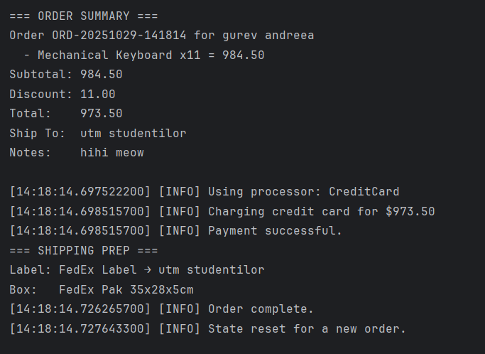

# Creational Design Patterns
Author: Gurev Andreea
----

## Objectives:
* Get familiar with the Creational Design Patterns;
* Choose a specific domain;
* Implement at least 3 Creational Design Patterns for the specific domain;

## Used Design Patterns:
* Singleton Pattern
* Builder Pattern
* Factory Method Pattern
* Abstract Factory Pattern

## Implementation

### 1. Singleton Pattern

The Singleton pattern ensures that only one instance of the Logger class exists throughout the application lifecycle. This implementation uses double-checked locking for thread safety while maintaining performance.

The Logger class provides centralized logging functionality, preventing multiple logger instances from being created and ensuring consistent log formatting across the entire application.

```java
class Logger {
    private static volatile Logger instance;
    private Logger() { }

    public static Logger getInstance() {
        if (instance == null) {
            synchronized (Logger.class) {
                if (instance == null) instance = new Logger();
            }
        }
        return instance;
    }

    public void info(String msg) {
        System.out.println("[" + LocalTime.now() + "] [INFO] " + msg);
    }

    public void warn(String msg) {
        System.out.println("[" + LocalTime.now() + "] [WARN] " + msg);
    }
}
```

Usage example from Main.java:
```java
private static final Logger LOG = Logger.getInstance();
LOG.info("Welcome! (Singleton, Builder, Factory Method, Abstract Factory demo)");
```

### 2. Builder Pattern

The Builder pattern is implemented in the Order class to construct complex order objects step-by-step. This pattern is particularly useful here because orders have many optional parameters (discount, notes) alongside required fields (orderId, customerName, shippingAddress, items).

The Builder pattern provides a fluent interface for order creation, making the code more readable and maintainable while ensuring that all required fields are validated before object construction.

```java
class Order {
    final String orderId;
    final String customerName;
    final String shippingAddress;
    final List<OrderItem> items;
    final double discount;
    final String notes;

    private Order(Builder b) {
        if (b.orderId == null || b.orderId.isBlank()) 
            throw new IllegalArgumentException("orderId required");
        if (b.customerName == null || b.customerName.isBlank()) 
            throw new IllegalArgumentException("customerName required");
        if (b.shippingAddress == null || b.shippingAddress.isBlank()) 
            throw new IllegalArgumentException("shippingAddress required");
        if (b.items.isEmpty()) 
            throw new IllegalArgumentException("At least one item required");
        this.orderId = b.orderId;
        this.customerName = b.customerName;
        this.shippingAddress = b.shippingAddress;
        this.items = List.copyOf(b.items);
        this.discount = b.discount;
        this.notes = b.notes;
    }

    static class Builder {
        private String orderId;
        private String customerName;
        private String shippingAddress;
        private final List<OrderItem> items = new ArrayList<>();
        private double discount = 0.0;
        private String notes = "";

        public Builder orderId(String orderId) { this.orderId = orderId; return this; }
        public Builder customer(String name) { this.customerName = name; return this; }
        public Builder shipTo(String address) { this.shippingAddress = address; return this; }
        public Builder addItem(Product p, int qty) { 
            this.items.add(new OrderItem(p, qty)); 
            return this; 
        }
        public Builder discount(double amount) { this.discount = amount; return this; }
        public Builder notes(String notes) { this.notes = notes; return this; }

        public Order build() { return new Order(this); }
    }
}
```

Usage example from checkout flow:
```java
Order.Builder b = new Order.Builder()
        .orderId(genOrderId())
        .customer(customerName)
        .shipTo(shippingAddress)
        .discount(discount)
        .notes(notes == null ? "" : notes);

for (OrderItem it : CART) {
    b.addItem(it.product, it.quantity);
}

Order order = b.build();
```

### 3. Factory Method Pattern

The Factory Method pattern is implemented through the `PaymentProcessorCreator` abstract class and its concrete subclasses. This pattern delegates the instantiation of payment processors to subclasses, allowing the system to support multiple payment methods without modifying the core payment processing logic.

The pattern provides flexibility to add new payment methods (like Bitcoin, Apple Pay) by simply creating new creator subclasses without changing existing code.

```java
abstract class PaymentProcessorCreator {
    // The Factory Method
    protected abstract PaymentProcessor createProcessor();

    // Template operation using the product created by the factory method
    public boolean pay(Order order) {
        PaymentProcessor p = createProcessor();
        Logger.getInstance().info("Using processor: " + p.name());
        return p.process(order);
    }
}

class CreditCardProcessorCreator extends PaymentProcessorCreator {
    @Override
    protected PaymentProcessor createProcessor() { 
        return new CreditCardProcessor(); 
    }
}

class PaypalProcessorCreator extends PaymentProcessorCreator {
    @Override
    protected PaymentProcessor createProcessor() { 
        return new PaypalProcessor(); 
    }
}
```

Payment processor implementations:
```java
interface PaymentProcessor {
    boolean process(Order order);
    String name();
}

class CreditCardProcessor implements PaymentProcessor {
    public boolean process(Order order) {
        Logger.getInstance().info("Charging credit card for $" + 
            String.format("%.2f", order.total()));
        return true;
    }
    public String name() { return "CreditCard"; }
}

class PaypalProcessor implements PaymentProcessor {
    public boolean process(Order order) {
        Logger.getInstance().info("Processing PayPal payment of $" + 
            String.format("%.2f", order.total()));
        return true;
    }
    public String name() { return "PayPal"; }
}
```

Usage in checkout:
```java
PaymentProcessorCreator creator = "card".equalsIgnoreCase(paymentChoice)
        ? new CreditCardProcessorCreator()
        : new PaypalProcessorCreator();

boolean paid = creator.pay(order);
```

### 4. Abstract Factory Pattern

The Abstract Factory pattern is implemented for the shipping system, creating families of related objects (shipping labels and package boxes) for different carriers. Each factory (DHLFactory, FedExFactory) produces a complete set of compatible shipping components.

This pattern ensures that shipping labels and boxes from the same carrier are always used together, preventing mismatches like a DHL label on a FedEx box.

```java
interface ShippingFactory {
    ShippingLabel createLabel(String destination);
    PackageBox createBox();
}

class DHLFactory implements ShippingFactory {
    public ShippingLabel createLabel(String destination) { 
        return new DHLLabel(destination); 
    }
    public PackageBox createBox() { 
        return new DHLBox(); 
    }
}

class FedExFactory implements ShippingFactory {
    public ShippingLabel createLabel(String destination) { 
        return new FedExLabel(destination); 
    }
    public PackageBox createBox() { 
        return new FedExBox(); 
    }
}
```

Product interfaces and implementations:
```java
interface ShippingLabel { String render(); }
interface PackageBox   { String spec();    }

// DHL products
class DHLLabel implements ShippingLabel {
    private final String to;
    DHLLabel(String to) { this.to = to; }
    public String render() { return "DHL Label → " + to; }
}

class DHLBox implements PackageBox {
    public String spec() { return "DHL Standard Box 40x30x20cm"; }
}

// FedEx products
class FedExLabel implements ShippingLabel {
    private final String to;
    FedExLabel(String to) { this.to = to; }
    public String render() { return "FedEx Label → " + to; }
}

class FedExBox implements PackageBox {
    public String spec() { return "FedEx Pak 35x28x5cm"; }
}
```

Usage in shipping preparation:
```java
ShippingFactory shipFactory = "fedex".equalsIgnoreCase(carrierChoice)
        ? new FedExFactory()
        : new DHLFactory();

ShippingLabel label = shipFactory.createLabel(order.shippingAddress);
PackageBox box = shipFactory.createBox();

System.out.println("Label: " + label.render());
System.out.println("Box:   " + box.spec());
```

## Conclusions / Results



This project successfully demonstrates the implementation of four creational design patterns in a real-world e-commerce order management system:

**Key Benefits Achieved:**

1. **Singleton Pattern** - Ensured single point of logging with thread-safe implementation, providing consistent log formatting and preventing resource waste from multiple logger instances.

2. **Builder Pattern** - Simplified complex order object construction with a fluent, readable interface. The pattern handles validation elegantly and makes it easy to add optional parameters without constructor proliferation.

3. **Factory Method Pattern** - Enabled flexible payment processing system that can easily accommodate new payment methods. The pattern decouples payment selection from payment execution, following the Open/Closed Principle.

4. **Abstract Factory Pattern** - Created a robust shipping system that guarantees compatible components (labels and boxes) for each carrier. Adding a new carrier requires only implementing the factory interface without modifying existing code.

**System Features:**

- Interactive CLI-based order management
- Product catalog browsing
- Shopping cart with add/update/remove operations
- Multiple payment methods (Credit Card, PayPal)
- Multiple shipping carriers (DHL, FedEx)
- Order validation and discount support
- Comprehensive logging throughout the workflow

**Design Pattern Synergy:**

The patterns work together seamlessly: the Singleton Logger is used across all components, the Builder creates validated orders, the Factory Method selects payment processors dynamically, and the Abstract Factory ensures shipping component compatibility. This combination creates a maintainable, extensible system that adheres to SOLID principles.

The implementation demonstrates how creational patterns solve real software design challenges by controlling object creation, reducing coupling, and improving code maintainability and testability.