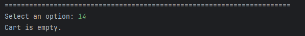
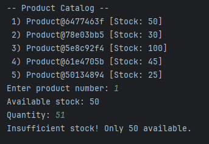
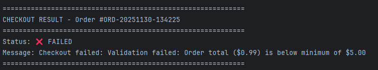
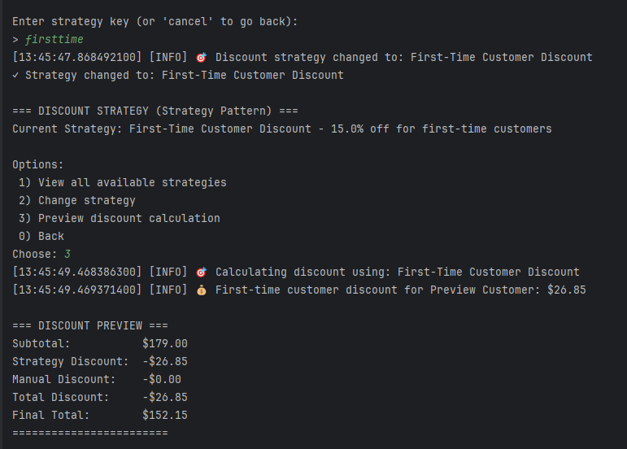

# Gurev Andreea: Laboratory Work #3 Report


---

## Introduction

This laboratory work demonstrates the implementation of **three behavioral design patterns** in an e-commerce system. The patterns were integrated into the existing project from Labs 0-2, which already implements creational and structural patterns.

### Behavioral Patterns Implemented:
1. **Chain of Responsibility** - For multi-step order validation
2. **Observer** - For order status notifications
3. **Strategy** - For flexible discount calculation

---

## Implemented Patterns

### 1. Chain of Responsibility Pattern

**Purpose**: Creates a chain of validation handlers where each handler processes the order validation request or passes it to the next handler in the chain.

**Location**: `OrderValidationChain.java`

**Key Components**:
- **Abstract Handler**: `OrderValidationHandler`
- **Concrete Handlers**:
    - `BasicOrderValidationHandler` - Validates basic order information
    - `InventoryValidationHandler` - Checks stock availability
    - `OrderValueValidationHandler` - Validates order total against min/max limits
    - `ProductAvailabilityHandler` - Checks product availability and quantity limits
- **Context**: `OrderValidationContext` - Passes data through the chain
- **Result**: `ValidationResult` - Contains validation outcome and warnings

**Benefits**:
- Decouples order validation logic into separate, reusable handlers
- Easy to add new validation steps without modifying existing code
- Flexible chain configuration (standard or quick validation)
- Provides detailed validation results with warnings

**Example Usage**:
```java
// Build validation chain
OrderValidationHandler chain = OrderValidationChainBuilder.buildStandardChain(inventoryManager);

// Validate order
OrderValidationContext context = new OrderValidationContext(inventoryManager);
ValidationResult result = chain.validate(order, context);

if (!result.isValid()) {
    System.out.println("Validation failed: " + result.getMessage());
}
```

**Integration**:
The chain is used in `CheckoutFacade.processCheckout()` to validate orders before processing:
```java
ValidationResult validationResult = validationChain.validate(order, context);
if (!validationResult.isValid()) {
    result.setFailure("Validation failed: " + validationResult.getMessage());
    return result;
}
```

---

### 2. Observer Pattern

**Purpose**: Defines a one-to-many dependency between objects so that when the order status changes, all dependent systems are notified automatically.

**Location**: `OrderObserver.java`

**Key Components**:
- **Subject Interface**: `OrderSubject` - Defines attach/detach/notify operations
- **Observer Interface**: `OrderObserver` - Defines update method
- **Concrete Subject**: `ObservableOrderTracker` - Manages observers and order statuses
- **Concrete Observers**:
    - `EmailNotificationObserver` - Sends email notifications
    - `SMSNotificationObserver` - Sends SMS notifications
    - `AnalyticsObserver` - Records order statistics
    - `InventoryUpdateObserver` - Handles inventory-related actions
    - `AuditLogObserver` - Maintains audit trail
- **Event Object**: `OrderEvent` - Contains status change information
- **Status Enum**: `OrderStatus` - Defines possible order states

**Benefits**:
- Loose coupling between order processing and notification systems
- Easy to add new observers without modifying existing code
- All interested parties are automatically notified of status changes
- Supports metadata passing with events

**Example Usage**:
```java
// Create observable tracker
ObservableOrderTracker tracker = new ObservableOrderTracker();

// Attach observers
tracker.attach(new EmailNotificationObserver());
tracker.attach(new SMSNotificationObserver());
tracker.attach(new AnalyticsObserver());

// Update status - all observers are notified
tracker.updateOrderStatus("ORD-123", OrderStatus.PAYMENT_CONFIRMED);
```

**Order Statuses**:
- CREATED
- VALIDATED
- PAYMENT_PENDING
- PAYMENT_CONFIRMED
- PROCESSING
- READY_TO_SHIP
- SHIPPED
- DELIVERED
- CANCELLED
- FAILED

**Integration**:
The observer pattern is integrated into `CheckoutFacade` and notifies observers at each checkout step:
```java
// Notify validation complete
orderTracker.updateOrderStatus(order.orderId, OrderStatus.VALIDATED);

// Notify payment confirmed with metadata
Map<String, Object> metadata = new HashMap<>();
metadata.put("totalAmount", finalAmount);
orderTracker.updateOrderStatus(order.orderId, OrderStatus.PAYMENT_CONFIRMED, metadata);
```

---

### 3. Strategy Pattern

**Purpose**: Defines a family of discount calculation algorithms, encapsulates each one, and makes them interchangeable. The strategy lets the discount algorithm vary independently from the order processing logic.

**Location**: `DiscountStrategy.java`

**Key Components**:
- **Strategy Interface**: `DiscountStrategy` - Defines discount calculation method
- **Concrete Strategies**:
    - `NoDiscountStrategy` - No discount applied
    - `PercentageDiscountStrategy` - Percentage-based discount
    - `FixedAmountDiscountStrategy` - Fixed dollar amount discount
    - `BulkOrderDiscountStrategy` - Discount for large quantity orders
    - `SeasonalDiscountStrategy` - Month-specific discounts
    - `TieredDiscountStrategy` - Spend-based tiered discounts
    - `FirstTimeCustomerStrategy` - Discount for new customers
- **Context**: `DiscountCalculator` - Uses the strategy
- **Manager**: `DiscountStrategyManager` - Manages available strategies

**Available Strategies**:
1. **None** - Standard pricing
2. **Percentage** - 10%, 15%, or 20% off
3. **Fixed Amount** - $5 or $10 off
4. **Bulk Order** - 15% off for 10+ items
5. **Seasonal** - 20% off during specific months
6. **Tiered** - Progressive discounts ($50+→5%, $100+→10%, $200+→15%, $500+→20%)
7. **First-Time Customer** - 15% off for new customers

**Benefits**:
- Flexible discount calculation without modifying order processing code
- Easy to add new discount strategies
- Strategies can be changed at runtime
- Clear separation of concerns

**Example Usage**:
```java
// Create discount calculator with a strategy
DiscountCalculator calculator = new DiscountCalculator(
    new PercentageDiscountStrategy(15)
);

// Calculate discount for an order
double discount = calculator.calculateDiscount(order);

// Change strategy at runtime
calculator.setStrategy(new TieredDiscountStrategy());
double newDiscount = calculator.calculateDiscount(order);
```

**Integration**:
In `Main.java`, users can select discount strategies through the menu:
```java
// Menu option to manage discount strategy
private static void manageDiscountStrategy() {
    strategyManager.listStrategies();
    // User selects a strategy
    discountCalculator.setStrategy(selectedStrategy);
}

// Applied during checkout
double strategyDiscount = discountCalculator.calculateDiscount(order);
```

---

## Code Structure

### File Organization

```
project/
├── Main.java                    # Updated main application with all patterns
├── CheckoutFacade.java          # Updated facade with Chain & Observer
├── OrderValidationChain.java    # Chain of Responsibility implementation
├── OrderObserver.java           # Observer pattern implementation
├── DiscountStrategy.java        # Strategy pattern implementation
├── [Previous Lab Files]
│   ├── Logger.java              # Singleton pattern
│   ├── Order.java               # Builder pattern
│   ├── PaymentFactory.java      # Factory Method pattern
│   ├── ShippingFactory.java     # Abstract Factory pattern
│   ├── OrderDecorator.java      # Decorator pattern
│   └── InventoryAdapter.java    # Adapter pattern
└── README_LAB3.md              # This documentation
```

### Pattern Integration Diagram

```
┌─────────────────────────────────────────────────────────────┐
│                         Main Menu                            │
│  (User Interface with Strategy Pattern Integration)         │
└──────────────────────┬──────────────────────────────────────┘
                       │
                       ▼
┌─────────────────────────────────────────────────────────────┐
│                    CheckoutFacade                            │
│  ┌──────────────────────────────────────────────────────┐  │
│  │  Chain of Responsibility: Order Validation           │  │
│  │  BasicValidation → Inventory → Value → Product       │  │
│  └──────────────────────────────────────────────────────┘  │
│  ┌──────────────────────────────────────────────────────┐  │
│  │  Observer Pattern: Status Notifications              │  │
│  │  Email, SMS, Analytics, Inventory, Audit observers   │  │
│  └──────────────────────────────────────────────────────┘  │
└─────────────────────────────────────────────────────────────┘
                       │
                       ▼
┌─────────────────────────────────────────────────────────────┐
│              DiscountCalculator (Strategy Context)           │
│  Uses selected DiscountStrategy to calculate discounts      │
└─────────────────────────────────────────────────────────────┘
```

---

## Usage Examples

### Example 1: Chain of Responsibility

```java
// The chain validates orders before checkout
public CheckoutResult processCheckout(Order order, ...) {
    // Step 1: Run validation chain
    OrderValidationContext context = new OrderValidationContext(inventoryManager);
    ValidationResult result = validationChain.validate(order, context);
    
    if (!result.isValid()) {
        return new CheckoutResult(false, result.getMessage());
    }
    
    // Display warnings
    for (String warning : result.getWarnings()) {
        logger.warn(warning);
    }
    
    // Continue with checkout...
}
```

**Output Example**:
```
🔍 Chain Step 1: Validating basic order information...
✓ Basic validation passed
🔍 Chain Step 2: Validating inventory availability...
⚠️  Low stock alert for Wireless Mouse (only 15 remaining)
✓ Inventory validation passed
🔍 Chain Step 3: Validating order value...
✓ Order value validation passed
🔍 Chain Step 4: Validating product availability...
✓ Product availability validation passed
```

### Example 2: Observer Pattern

```java
// Observers are notified automatically when status changes
orderTracker.updateOrderStatus("ORD-20251130-143022", OrderStatus.PAYMENT_CONFIRMED);

// All observers receive the notification:
// - EmailNotificationObserver sends confirmation email
// - SMSNotificationObserver sends text message
// - AnalyticsObserver records the event
// - InventoryUpdateObserver processes inventory changes
// - AuditLogObserver creates audit entry
```

**Output Example**:
```
📢 Notifying 5 observers about: OrderEvent[ORD-20251130-143022: PAYMENT_PENDING → PAYMENT_CONFIRMED at 14:30:22]
📧 EMAIL: Sending notification for order ORD-20251130-143022
   ✉️  Email: [Payment Confirmation] Your payment has been confirmed
📱 SMS: Sending notification for order ORD-20251130-143022
   📲 SMS: Order ORD-20251130-143022: Payment Confirmed
📊 ANALYTICS: Recording status change
   📈 Analytics: Status 'Payment Confirmed' count: 1
📝 AUDIT: [2025-11-30 14:30:22] Order ORD-20251130-143022: PAYMENT_PENDING → PAYMENT_CONFIRMED
```

### Example 3: Strategy Pattern

```java
// User selects tiered discount strategy
discountCalculator.setStrategy(new TieredDiscountStrategy());

// Calculate discount based on order value
Order order = // ... order with $150 subtotal
double discount = discountCalculator.calculateDiscount(order);
// Returns $15 (10% tier applies for $100+)

// User changes to percentage discount
discountCalculator.setStrategy(new PercentageDiscountStrategy(20));
discount = discountCalculator.calculateDiscount(order);
// Returns $30 (20% of $150)
```

**Output Example**:
```
=== AVAILABLE DISCOUNT STRATEGIES ===
1) none - No Discount
   Standard pricing - no discounts applied
2) percent10 - Percentage Discount
   10% off entire order
3) tiered - Tiered Discount
   Tiered discounts: $50+ → 5% off; $100+ → 10% off; $200+ → 15% off; $500+ → 20% off;
=====================================

🎯 Discount strategy changed to: Tiered Discount
💰 Tiered discount (tier: $100.0 -> 10%): $15.00
```

### Complete Checkout Flow

```
1. User adds items to cart
2. User selects discount strategy (Strategy Pattern)
3. User proceeds to checkout
4. CheckoutFacade validates order (Chain of Responsibility)
   - Basic validation
   - Inventory check
   - Value validation
   - Product availability
5. If validation passes:
   - Status → VALIDATED (Observer notifies all observers)
   - Reserve inventory
   - Process payment
   - Status → PAYMENT_CONFIRMED (Observer notifies)
   - Prepare shipping
   - Status → PROCESSING (Observer notifies)
   - Status → READY_TO_SHIP (Observer notifies)
6. Order complete with full audit trail
```

---

## Pattern Benefits

### Chain of Responsibility
- Single Responsibility: Each handler has one validation concern
- Open/Closed: Easy to add new validators without changing existing code
- Flexible: Can reorder or skip handlers
- Detailed feedback: Warnings and error messages

### Observer
- Loose coupling: Order processing doesn't know about notification systems
- Dynamic subscriptions: Observers can be added/removed at runtime
- Broadcast communication: One status change notifies all interested parties
- Event metadata: Rich context passed with notifications

### Strategy
- Runtime flexibility: Discount algorithm can change during execution
- Eliminates conditionals: No need for large if/else or switch statements
- Easy testing: Each strategy can be tested independently
- Business rules encapsulation: Discount logic is separated from order processing

---

## Conclusion

This laboratory work successfully demonstrates the implementation of three behavioral design patterns in a real-world e-commerce scenario:

1. **Chain of Responsibility** enables flexible, extensible order validation with clear separation of concerns.

2. **Observer** provides a robust event notification system that keeps multiple subsystems synchronized without tight coupling.

3. **Strategy** allows dynamic discount calculation with easily interchangeable algorithms.

These patterns complement the creational (Singleton, Builder, Factory Method, Abstract Factory) and structural (Decorator, Adapter, Facade) patterns from previous labs, creating a comprehensive, maintainable, and extensible e-commerce system.

### Key Takeaways:
- Behavioral patterns focus on object interaction and responsibility distribution
- They make systems more flexible and easier to maintain
- Combining multiple patterns creates powerful, reusable architectures
- Real-world applications often benefit from using multiple patterns together

---


### Testing the Behavioral Patterns:

1. **Test Chain of Responsibility**:
    - Try to checkout with empty cart (fails basic validation)

    - Try to order more items than available (fails inventory validation)

    - Try to create order under $5 (fails value validation)


2. **Test Observer**:
    - Complete a full checkout and observe notifications

3. **Test Strategy**:
    - Go to menu option 12 (Manage discount strategy)
    - Select different strategies
    - Use option 3 to preview discount calculations

---

**End of Documentation**